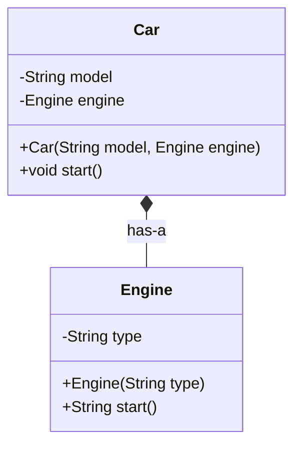

# Composition

Composition means building a class using other classes as parts ("has-a" relationship), instead of inheriting from them.

In this example:
- `Car` has an `Engine`.
- `Car.start()` delegates part of its behavior to `engine.start()`.
- `Car` and `Engine` stay loosely focused on their own responsibilities.

## Class Diagram



## Behavior Visualization

```mermaid
flowchart LR
    A[CompositionDemo] --> B[Create Engine]
    B --> C[Create Car with Engine]
    C --> D[car.start()]
    D --> E[engine.start()]
    E --> F[Print combined message]
```

## ASCII Diagram

```text
+---------------------+      creates      +----------------------+
|   CompositionDemo   | ----------------> | Engine("Petrol")     |
+---------------------+                   +----------+-----------+
                                                      |
                                                      | injected into
                                                      v
                                         +---------------------------+
                                         | Car("Sedan", engine)      |
                                         |---------------------------|
                                         | - model  : String         |
                                         | - engine : Engine         |
                                         | + start()                 |
                                         +-------------+-------------+
                                                       |
                                                       | delegates
                                                       v
                                         +---------------------------+
                                         | engine.start()            |
                                         +-------------+-------------+
                                                       |
                                                       v
                                         "Sedan: Petrol engine started"
```

Think of this like a car assembled from components: the car uses an engine; it is not a type of engine.
