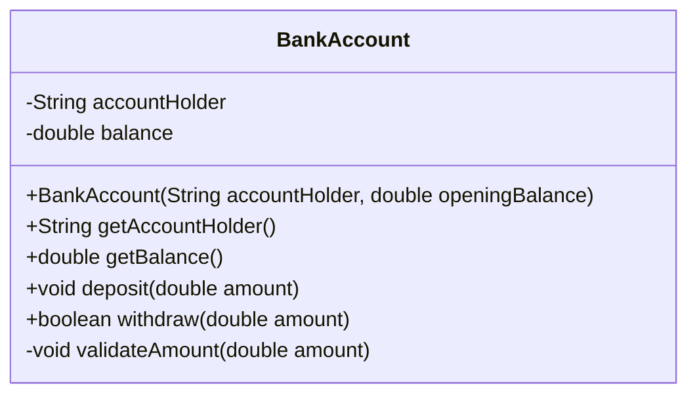
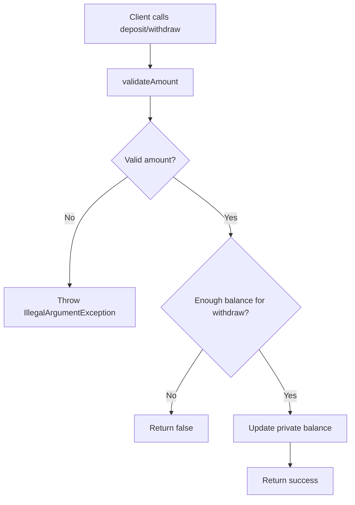

# Encapsulation

Encapsulation means keeping data private inside a class and exposing controlled ways to read or change it.

In this example:
- `BankAccount` hides `balance` as a private field.
- Updates happen only through `deposit()` and `withdraw()`.
- Validation logic is also hidden inside the class (`validateAmount()`).

## Class Diagram



## Behavior Visualization



## ASCII Diagram

```text
+--------+      calls deposit()/withdraw()      +---------------------------+
| Client | -----------------------------------> |        BankAccount        |
+--------+                                      |---------------------------|
                                                | - accountHolder : String  |
                                                | - balance : double        |
                                                |   (private)               |
                                                |---------------------------|
                                                | + deposit(amount)         |
                                                | + withdraw(amount):bool   |
                                                | + getBalance():double     |
                                                +-------------+-------------+
                                                              |
                                                              | internal guard
                                                              v
                                                +---------------------------+
                                                | validateAmount(amount)    |
                                                +---------------------------+
                                                              |
                                      +-----------------------+----------------------+
                                      |                                              |
                                      v                                              v
                           invalid amount -> exception                valid -> update balance
```

Think of this like a bank counter: you cannot edit the ledger directly; all changes go through approved operations.
