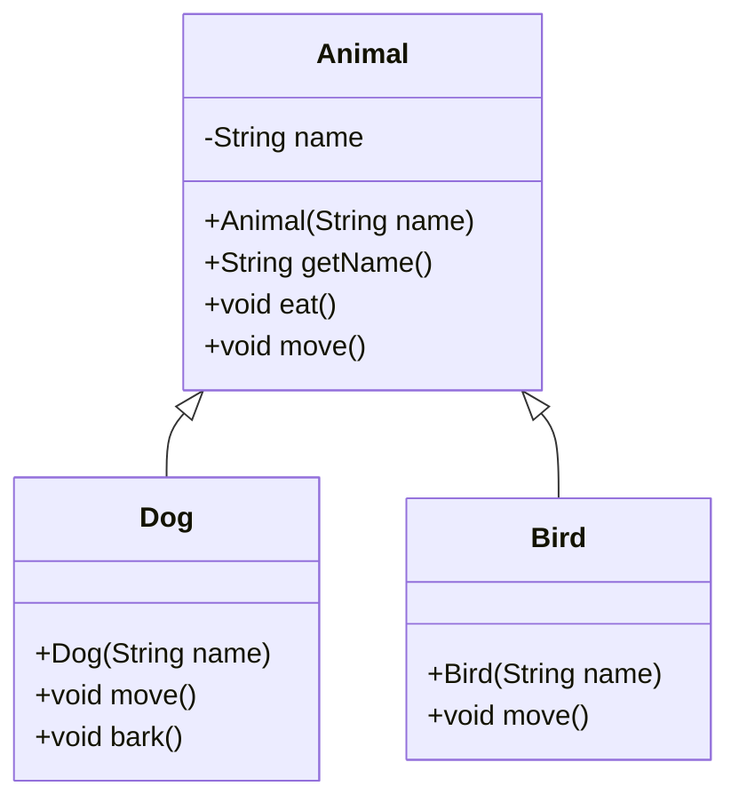
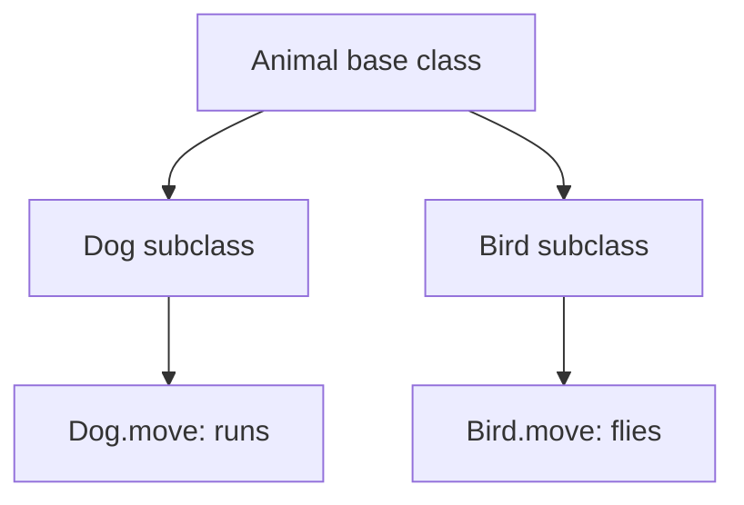

# Inheritance

Inheritance lets one class reuse and extend behavior from another class.

In this example:
- `Animal` provides common state and behavior (`name`, `eat()`, `move()`).
- `Dog` and `Bird` inherit from `Animal`.
- Child classes override `move()` to provide specialized behavior.

## Class Diagram



## Behavior Visualization



## ASCII Diagram

```text
                     +-------------------------+
                     |         Animal          |
                     |-------------------------|
                     | - name : String         |
                     | + eat()                 |
                     | + move()                |
                     +------------+------------+
                                  ^
                 extends          / \
                                /     \
                               /       \
              +----------------+--+   +--+----------------+
              |       Dog         |   |       Bird        |
              |-------------------|   |-------------------|
              | + bark()          |   | + move()          |
              | + move() override |   |   (override)      |
              +-------------------+   +-------------------+
```

Think of this like a family hierarchy: children share family traits but can have their own specific abilities.
