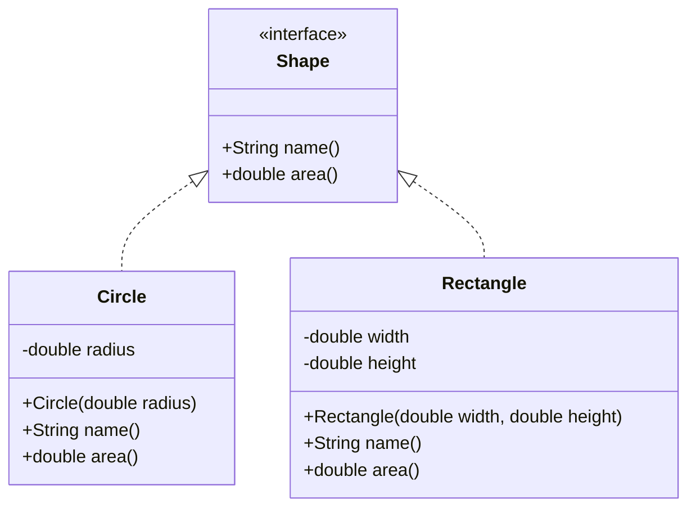
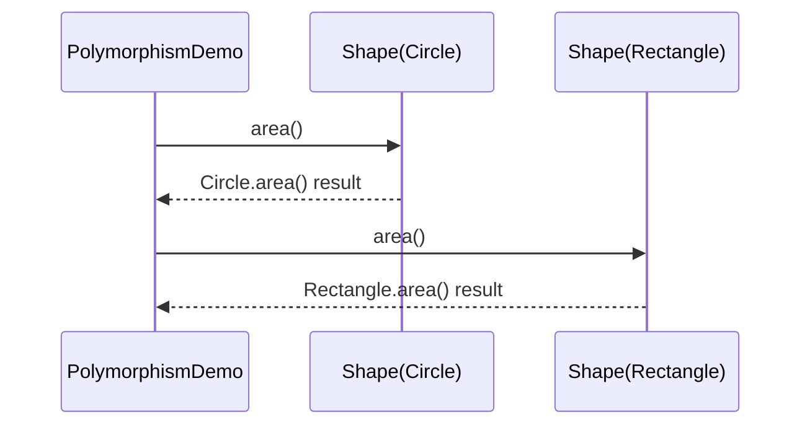

# Polymorphism

Polymorphism allows the same interface to represent different concrete behaviors.

In this example:
- `Shape` defines a common contract: `name()` and `area()`.
- `Circle` and `Rectangle` implement `Shape` differently.
- `PolymorphismDemo` treats both as `Shape` and calls the same methods.

## Class Diagram



## Runtime Visualization



## ASCII Diagram

```text
+------------------------+
| Shape (interface)      |
|------------------------|
| + name()               |
| + area()               |
+-----------+------------+
            ^
            | implements
   +--------+--------+----------------+
   |                 |                |
+--+-----------------+-+   +----------+-------------+
| Circle               |   | Rectangle              |
|----------------------|   |------------------------|
| - radius : double    |   | - width  : double      |
| + area() = PI * r * r|   | - height : double      |
+----------------------+   | + area() = w * h       |
                           +------------------------+

+----------------------------+
| PolymorphismDemo           |
|----------------------------|
| Shape[] shapes = {C, R}    |
| for each s -> s.area()     |
| runtime picks right area() |
+----------------------------+
```

Think of this like calling a common `play()` button on different music apps: same action, different internal implementation.
